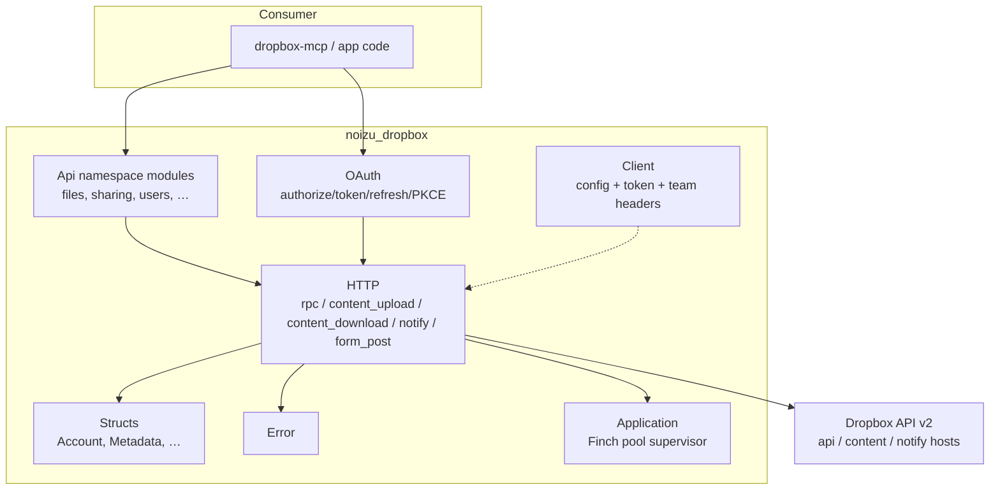

# Project Architecture — noizu_dropbox

## Overview

`noizu_dropbox` is a thin Elixir client for the **Dropbox API v2**. It wraps
the three Dropbox endpoint styles (RPC JSON, content upload, content download)
plus the OAuth2 short-lived-token/refresh/PKCE flow behind a uniform
`{:ok, term()} | {:error, %Noizu.Dropbox.Error{}}` contract. The primary
consumer is `Portfolio/Apps/AI/dropbox-mcp` (filesystem MCP server); the lib is
an API-contract layer kept aligned with the live Dropbox REST surface.
Runtime dependencies are deliberately minimal: **Finch** (HTTP) and **Jason**
(JSON) only.

## System Diagram

## Core Components

| Component | Purpose |
|-----------|---------|
| `Noizu.Dropbox.Client` | Immutable config/token record; opts merge over `:noizu_dropbox` app env; team acting via `as_user`/`as_admin` |
| `Noizu.Dropbox.HTTP` | Low-level transport: `rpc`, `rpc_empty`, `content_upload`, `content_download`, `notify`, `form_post`; decode modes `:atoms`/`:strings`/`:raw`/module `from_json/1` |
| `Noizu.Dropbox.OAuth` | Authorization URL builder, code exchange, refresh, `refresh_client/1`, PKCE S256 `pkce_pair/0` |
| `Noizu.Dropbox.Api.*` | One thin module per Dropbox namespace (`lib/dropbox/api/`) using `Api` macro for shared plumbing |
| Structs (`lib/dropbox/struct/`) | Typed responses with `from_json/1` + `raw` passthrough |
| `Noizu.Dropbox.Error` | Exception struct; constructors `from_response`/`transport`/`codec`/`config` |
| `Noizu.Dropbox.Application` | Starts the `Noizu.Dropbox.Finch` pool (sole supervised child) |

→ *Components ↔ directories: see [PROJ-LAYOUT.md](PROJ-LAYOUT.md)*

## Request Flow

1. Caller invokes an endpoint module (or passes its own `%Client{}` via
   `client:` opt; otherwise `Client.default()` from app env).
2. Module builds the JSON body / `Dropbox-API-Arg` and delegates to `HTTP`.
3. `HTTP` resolves auth (`:user` bearer, `:app` basic, `:none`), encodes, and
   dispatches through the `Noizu.Dropbox.Finch` pool.
4. Responses decode per `:decode` mode — into structs where defined, else maps;
   failures become `%Error{}` with status/summary/tag extracted from the body.

Design notes:
- **Opts-over-global**: per-call opts always beat app env; no process
  dictionary or global state.
- **Content endpoints** pass args via the `Dropbox-API-Arg` header and return
  metadata in `Dropbox-API-Result` on download.
- **OAuth secret handling**: Basic-auth header or form body, never both.
- **Team endpoints**: `select_user` / `select_admin` map to the corresponding
  Dropbox-API-Select-* headers on the client.

## Technology Stack

- Elixir ~> 1.14 (repo pins 1.20.1-otp-29 / Erlang 29 via `.tool-versions`)
- Finch ~0.18 (HTTP), Jason ~1.4 (JSON) — only runtime deps
- ExUnit with a Finch transport stub (`test/support/finch_stub.exs`) so the
  suite runs fully mocked; coverage threshold 30 (thin wrappers)

## Key Decisions

- **Thin wrapper, no DSL**: endpoint modules mirror the REST surface 1:1 so
  contract drift is visible; no schema generation or codegen.
- **Raw passthrough (`raw` field)**: unknown/extra response fields survive
  struct decoding, keeping the client forward-compatible.
- **Single Finch pool** under the app supervisor keeps deployment footprint
  minimal for embedding (e.g. inside dropbox-mcp).
